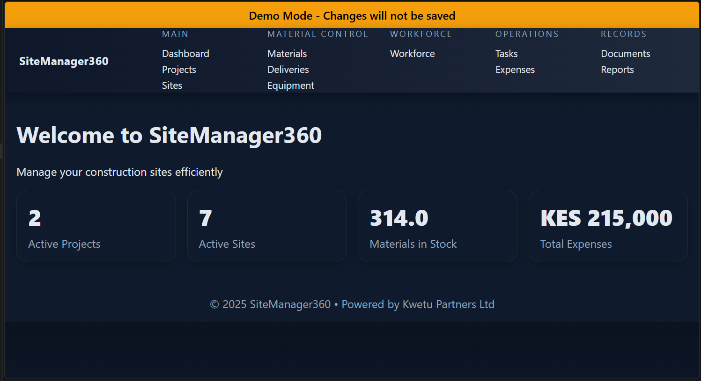
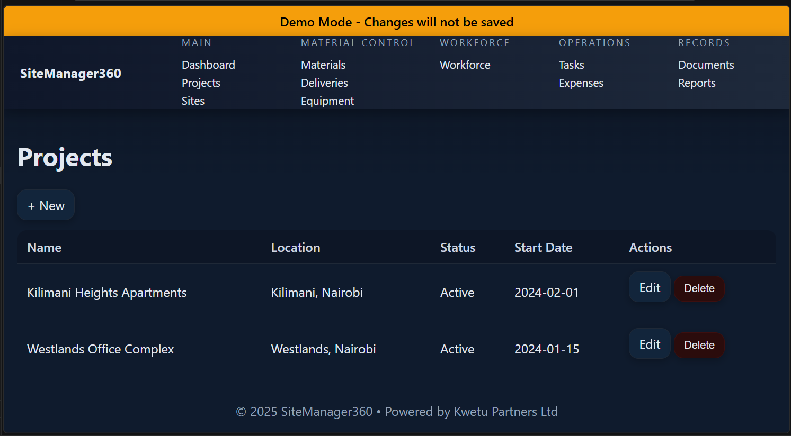
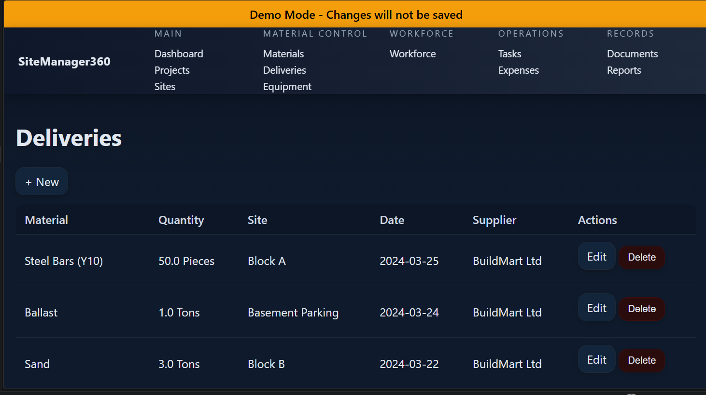
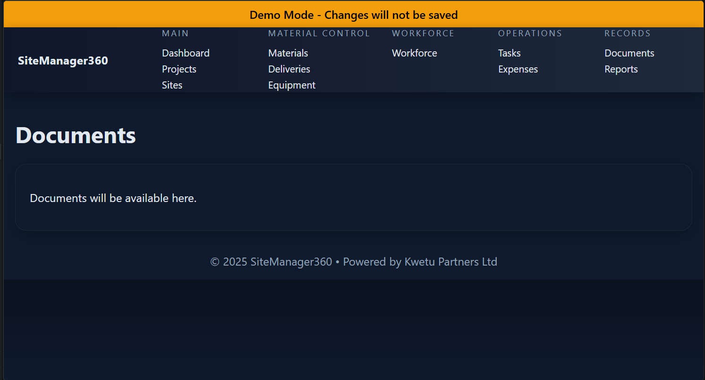

# SiteManager360 — Construction Project & Site Management Platform

SiteManager360 is a practical construction project and site management platform designed to help construction companies coordinate projects, manage site operations, track documentation, and improve operational visibility across multiple active sites.

Built by Kwetu Partners Ltd, the system focuses on operational clarity, structured project workflows, and practical field coordination for growing construction businesses.

---

# 🚀 Overview

SiteManager360 provides a centralized operational environment for managing construction workflows across multiple sites and projects.

The platform supports:

- Project tracking and coordination
- Site activity management
- Document upload and management
- Operational reporting
- Team coordination workflows
- Construction project visibility

The system is designed to simplify operational management for SMEs and growing construction firms without introducing unnecessary complexity.

---

# Why SiteManager360 Exists

Many small and medium construction companies still rely heavily on:

- paper-based site coordination
- WhatsApp-only communication
- fragmented document handling
- disconnected project tracking
- manual reporting systems

SiteManager360 was created to provide a practical operational platform that improves visibility, coordination, and accountability across active construction projects.

Kwetu Partners designed the system around a Monozukuri-inspired engineering philosophy focused on:

- operational simplicity
- workflow clarity
- reliability-first engineering
- scalable operational coordination
- long-term maintainability

---

# 🧠 Core Features

## Project Management
Create and manage multiple construction projects through structured operational workflows.

## Site Coordination
Track site-level operational activities and project progress.

## Document Management
Upload, preview, and manage project-related documents including:
- permits
- invoices
- approvals
- drawings
- operational records

## Operational Reporting
Monitor project progress and operational visibility through centralized dashboards.

## Team Coordination
Support communication and operational structure across project teams.

## Multi-Site Visibility
Manage multiple active sites within a single operational system.

## Mobile-Responsive Interface
Optimized for both desktop and mobile operational usage.

---

# 🏗️ System Architecture

SiteManager360 follows a modular Flask-based architecture focused on operational maintainability and deployment simplicity.

## Frontend
- HTML
- CSS
- JavaScript

## Backend
- Python
- Flask Framework

## Database
- SQLite (development)
- PostgreSQL-ready architecture for production deployment

## Deployment
- Render deployment support
- Railway-compatible deployment architecture

---

# 📸 Screenshots

### Dashboard


### Project Management


### Site Operations


### Document Management


---

# 🛠️ Tech Stack

## Backend
- Python
- Flask

## Frontend
- HTML
- CSS
- JavaScript

## Database
- SQLite

## Deployment & Infrastructure
- Render
- Railway

---

# ⚙️ Installation

## 1. Clone Repository

```bash
git clone https://github.com/kwetu-stack/SiteManager360.git
cd SiteManager360
2. Create Virtual Environment (Windows)
python -m venv .venv
.venv\Scripts\activate
Mac / Linux
source .venv/bin/activate
3. Install Requirements
pip install -r requirements.txt
4. Run Application
python app.py
5. Access System
http://127.0.0.1:5000
💼 Operational Workflow
Project Creation

Create construction projects and define operational tracking structures.

Site Coordination

Manage active site operations and project workflows.

Document Handling

Upload and organize operational project documents.

Operational Monitoring

Track progress, project visibility, and workflow coordination.

Reporting & Visibility

Generate centralized operational visibility across construction activities.

🌐 Live Demo

Public Demo:
https://kwetupartners.net/live-demo.html

The public demo allows users to interact with the platform in a controlled sandbox environment.

📈 Roadmap
v1.1
Enhanced project dashboards
Improved operational analytics
Advanced document categorization
v2.0
Full multi-tenant SaaS deployment
PostgreSQL production infrastructure
Centralized operational administration
v2.1
Site engineer mobile workflows
Real-time operational updates
Team assignment workflows
Future Vision
Material tracking
Contractor management
Site attendance systems
Procurement workflows
Advanced project analytics
🏢 About Kwetu Partners

Kwetu Partners Ltd is a Kenyan software engineering company focused on practical operational systems for SMEs.

The company combines real-world operational experience with modern software engineering to build reliable, affordable business platforms across:

Inventory Management
Logistics & Dispatch
Construction Management
Finance & Bookkeeping
Education Technology
Identity & Access Systems

Kwetu follows a Monozukuri-inspired engineering philosophy centered on craftsmanship, operational clarity, and long-term system reliability.

Website:
https://kwetupartners.net/

📄 License

MIT License — Free to use, modify, and distribute.

🌍 Built in Kenya

Designed and engineered by Kwetu Partners Ltd.

Built with a focus on solving real operational challenges faced by SMEs across emerging markets.